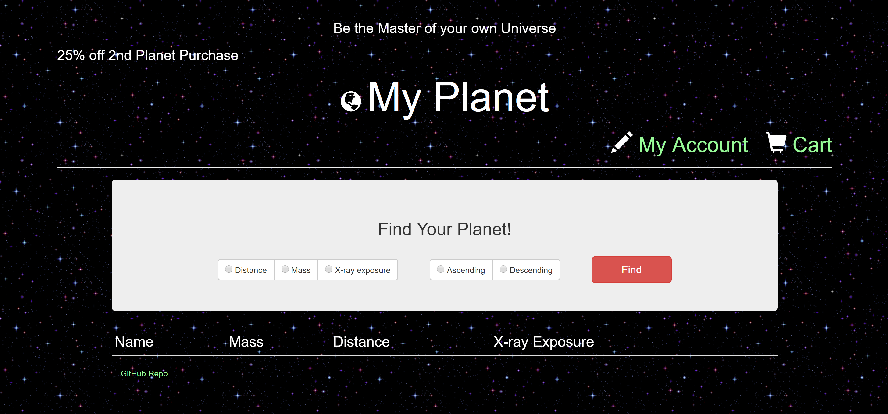
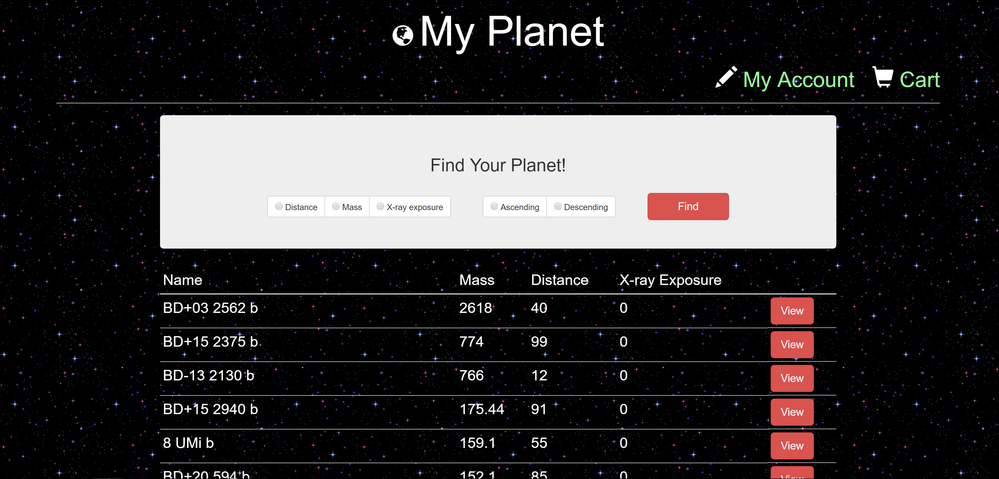
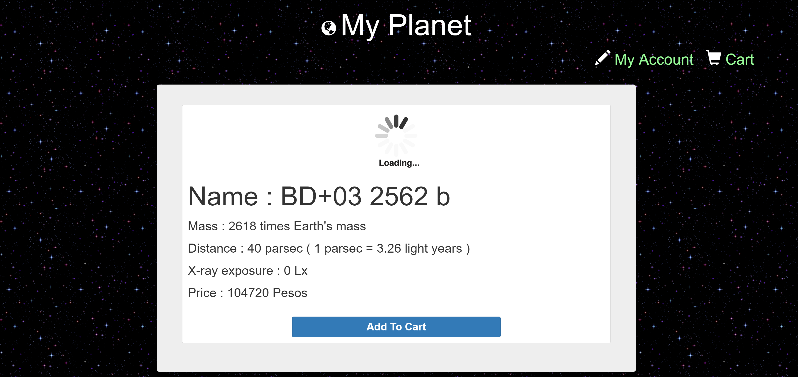
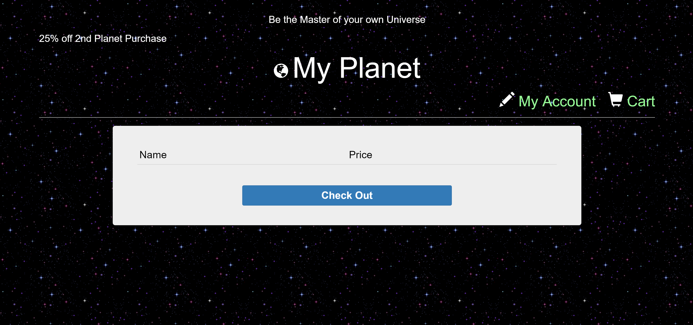
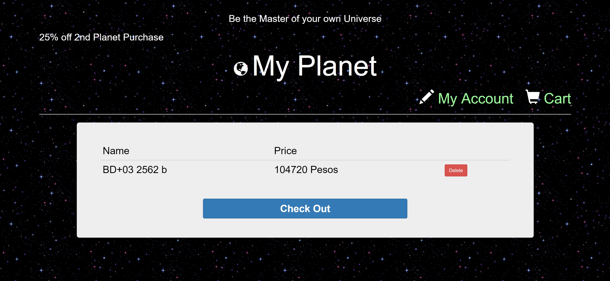
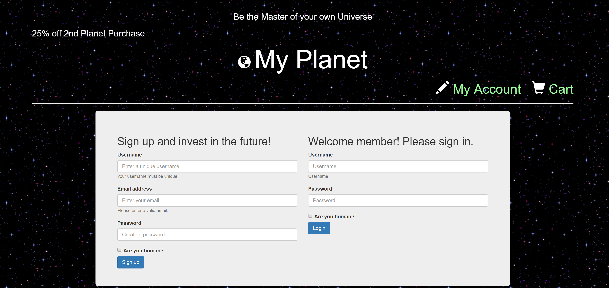
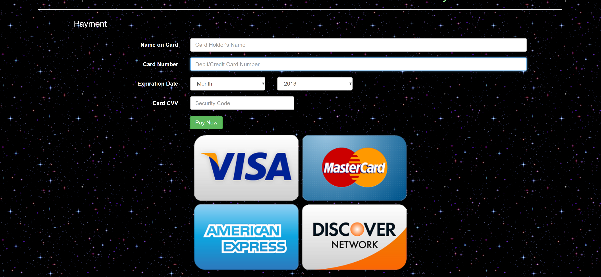

# My Planet

This web app lets the customer shops "existing" exoplanets. 
This app uses MySQL, Node, Express, Handlebars, and a homemade ORM. 
It follows the MVC design pattern and uses Node and MySQL to query and route data in the app, and Handlebars to generate the HTML.

### My Planet Main Page

***

Customers can access 'cart', 'My account' from main page.

***

Customers can search exoplanets by 'distance', 'mass', and 'x-ray exposure'. 

***

### My Planet Planet Page

***
This is the detailed info when 'view' button is clicked from main page.

***

### My Planet Cart Page

***

Cart Page when it's empty.

***

Cart Page when 'Add to Cart' button is clicked from planet page.

***

### My Planet Account Page

***

Customer can sign-up or log in from account page.

***

### My Planet Payment Page

***

When the customer is done with adding planets to the cart,  
'check out' button from cart page will direct customer to payment-page.

